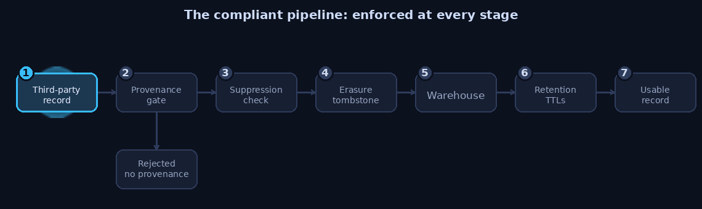

# GDPR-Compliant B2B Data Engineering

A reference implementation of GDPR compliance patterns for a B2B
prospecting / market-intelligence data pipeline: the legal reasoning
(legal basis, a full Legitimate Interest Assessment, electronic-marketing
rules) and the engineering patterns that actually enforce it in code
(provenance-as-architecture, an ingest gate, a role-vs-nominal email
classifier, a hashed suppression list, an erasure tombstone, and a
field-class retention engine).

This repository exists because "we rely on legitimate interest" is a
sentence teams say often and document rarely, and because the interesting
compliance failures in a prospecting pipeline are not legal misreadings,
they are architectural gaps: no LIA on file, a suppression list that gets
silently overwritten by the next import, an erasure that gets undone by
tomorrow's re-ingest. This repository is an attempt to close both gaps at
once: the reasoning, written down properly, and the code that holds the
reasoning's conclusions even under operational pressure.


## The compliant pipeline, in one picture

Compliance here is not a document that sits beside the pipeline. It is enforced
at each stage, so an unlawful record cannot flow through and an erased record
cannot come back.

<p align="center">
  
</p>

The nightly re-ingest runs this same gauntlet, which is why a suppression or an
erasure survives it instead of being quietly undone.

## Disclaimer

This is **educational reference material, not legal advice**. Data
protection law varies by jurisdiction, changes over time, and depends on
facts specific to your processing. Nothing here should be relied on
without review by a qualified Data Protection Officer or lawyer, and every
document in `docs/` repeats this disclaimer for a reason: read the code
and the templates as a well-reasoned starting point, not a certified
answer.

All data in this repository, every company name, person name, email
address, and phone number, is synthetic or obviously fictional. No real
company, client, or individual's data is used anywhere in this codebase.

## 10 rules for a compliant B2B prospecting database

1. **Attach provenance to every third-party-derived fact, at ingest, not
   after the fact.** Source URL, retrieval timestamp, and legal basis,
   or the record does not enter the warehouse. See
   [`gdpr_pipeline/provenance.py`](gdpr_pipeline/provenance.py) and
   [`gdpr_pipeline/ingest_gate.py`](gdpr_pipeline/ingest_gate.py).
2. **Write the Legitimate Interest Assessment down.** "We rely on
   legitimate interest" without a documented purpose test, necessity
   test, and balancing test is an assumption, not an assessment. See
   [`docs/LIA_TEMPLATE.md`](docs/LIA_TEMPLATE.md) and
   [`docs/LIA_WORKED_EXAMPLE.md`](docs/LIA_WORKED_EXAMPLE.md).
3. **Treat role addresses and nominal addresses differently, on
   purpose.** `office@company.example` and `jane.doe@company.example`
   carry different risk and deserve different handling. See
   [`gdpr_pipeline/email_class.py`](gdpr_pipeline/email_class.py).
4. **Holding a contact and marketing to it are two different legal
   questions.** GDPR legitimate interest can justify holding a record
   while national ePrivacy-derived marketing law still governs, and can
   still block, an unsolicited email or call to it. See
   [`docs/EPRIVACY_ROMANIA.md`](docs/EPRIVACY_ROMANIA.md).
5. **Suppression is checked at send time, not at list-build time.** A
   list frozen an hour before a suppression request is not an excuse. See
   [`gdpr_pipeline/suppression.py`](gdpr_pipeline/suppression.py).
6. **Suppression and erasure records are hashed, additive, and
   independent of the warehouse tables that get rebuilt.** A fresh
   import must never be able to silently undo either. Same modules as
   above, plus [`gdpr_pipeline/tombstone.py`](gdpr_pipeline/tombstone.py).
7. **Erasure has to survive re-ingest, or it is not erasure.** A nightly
   job that re-pulls from the same public source will resurrect a deleted
   record unless a tombstone blocks it. See
   [`docs/DATA_SUBJECT_RIGHTS.md`](docs/DATA_SUBJECT_RIGHTS.md).
8. **Retention is per field class, not per record.** Identity, contact,
   behavioural, and derived data decay at different rates and serve
   different purposes; one blanket retention period is almost always
   wrong for at least one of them. See
   [`gdpr_pipeline/retention.py`](gdpr_pipeline/retention.py) and
   [`docs/RETENTION.md`](docs/RETENTION.md).
9. **"We might need it later" is not a purpose.** If you cannot state,
   right now, in one sentence, what current purpose a field serves, it
   should not still be in the warehouse. See
   [`docs/RETENTION.md`](docs/RETENTION.md).
10. **When you collect data about someone from a third party, Article 14
    obligates you to tell them, including where the data came from.**
    Most prospecting data is collected this way, which makes this the
    default case, not the exception. See
    [`docs/ARTICLE_14_NOTICE_TEMPLATE.md`](docs/ARTICLE_14_NOTICE_TEMPLATE.md).

## What is actually in this repository

### Documentation (`docs/`)

| Document | What it covers |
|---|---|
| [`LEGAL_BASIS.md`](docs/LEGAL_BASIS.md) | When B2B prospecting data is lawful: the six Article 6 bases, why legitimate interest is the realistic one, and why holding data and marketing to it are separate questions. |
| [`LIA_TEMPLATE.md`](docs/LIA_TEMPLATE.md) | A blank, reusable Legitimate Interest Assessment: purpose test, necessity test, balancing test. |
| [`LIA_WORKED_EXAMPLE.md`](docs/LIA_WORKED_EXAMPLE.md) | The same template, filled in for a fictional company, so you can see what a real answer looks like. |
| [`EPRIVACY_ROMANIA.md`](docs/EPRIVACY_ROMANIA.md) | ePrivacy-derived electronic marketing rules, worked through Romania (Legea 506/2004, Legea 365/2002) as a concrete, hedged example. |
| [`DATA_SUBJECT_RIGHTS.md`](docs/DATA_SUBJECT_RIGHTS.md) | Access, erasure, and objection inside a pipeline that re-ingests from source, including the zombie-record problem and the tombstone pattern that solves it. |
| [`RETENTION.md`](docs/RETENTION.md) | Field-class TTLs, what to drop and why, and why "we might need it later" fails as a purpose. |
| [`ARTICLE_14_NOTICE_TEMPLATE.md`](docs/ARTICLE_14_NOTICE_TEMPLATE.md) | A structural template for the privacy notice required when data about someone is collected from a third party rather than from them. |

### Code (`gdpr_pipeline/`)

| Module | What it enforces |
|---|---|
| [`provenance.py`](gdpr_pipeline/provenance.py) | The `Provenance` dataclass (`source_url`, `retrieved_at`, `legal_basis`) and its validation rules. |
| [`ingest_gate.py`](gdpr_pipeline/ingest_gate.py) | Rejects any record lacking valid provenance or a legal basis, with structured, listable rejection reasons. |
| [`email_class.py`](gdpr_pipeline/email_class.py) | Classifies an address as role, nominal, junk, or unknown; biased towards caution when unsure. |
| [`suppression.py`](gdpr_pipeline/suppression.py) | A hashed suppression store, checked at send time, that a fresh import cannot silently overwrite. |
| [`tombstone.py`](gdpr_pipeline/tombstone.py) | Erasure markers that block a record from re-entering the warehouse on the next re-ingest. |
| [`retention.py`](gdpr_pipeline/retention.py) | A field-class TTL engine: different expiry rules for identity, contact, behavioural, and derived data. |
| [`demo.py`](gdpr_pipeline/demo.py) | An end-to-end, runnable story exercising every module above against a fully synthetic dataset. |

## Quickstart

Requires Python 3.11 or later. No dependencies for the library itself;
`pytest` is only needed to run the tests.

```bash
git clone <this-repository>
cd gdpr-b2b-data-engineering
python3 -m venv .venv && source .venv/bin/activate
pip install -r requirements.txt

# Run the end-to-end demo (prints a full ingest -> reject -> suppress ->
# erase -> re-ingest -> retention story to stdout, using only synthetic data)
python -m gdpr_pipeline.demo

# Run the test suite
pytest -v
```

Everything runs offline. Nothing in this repository makes a network call,
scrapes a live website, or touches real data of any kind.

## What this repository deliberately does not do

- It does not scrape, describe how to scrape, or name any commercial data
  source (a companies-lookup website, a business directory, or similar).
  Every example refers only to official/public registers in the abstract
  (a "national companies registry", a "public tenders portal") and to
  first-party sources (a company's own published website).
- It does not ship a production-grade suppression or tombstone store (no
  database, no concurrency handling, no key rotation tooling): the
  patterns are real and directly portable, the storage backend
  (`json` on disk here) is a demonstration choice, chosen so the whole
  repository runs offline with the standard library alone.
- It does not attempt to cover every EU member state's ePrivacy
  transposition. Romania is used as one concrete, worked example
  precisely to show the kind of local-law check every jurisdiction needs,
  not to claim the answer generalises.

## License

MIT. See [`LICENSE`](LICENSE).
