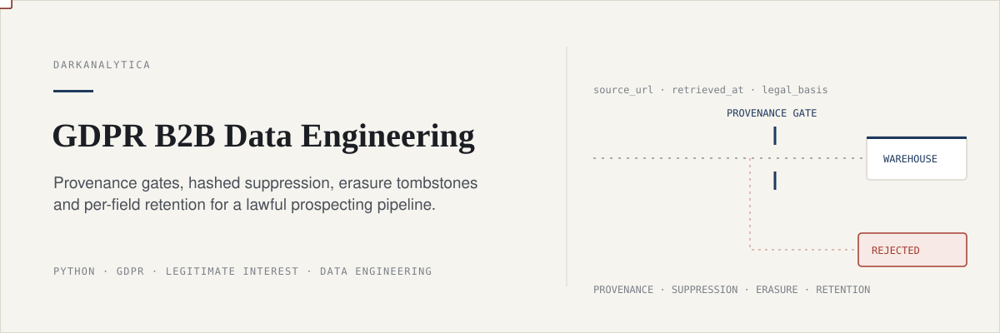
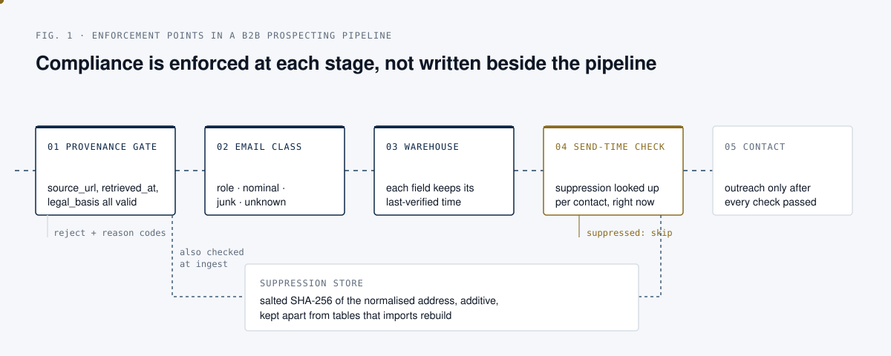
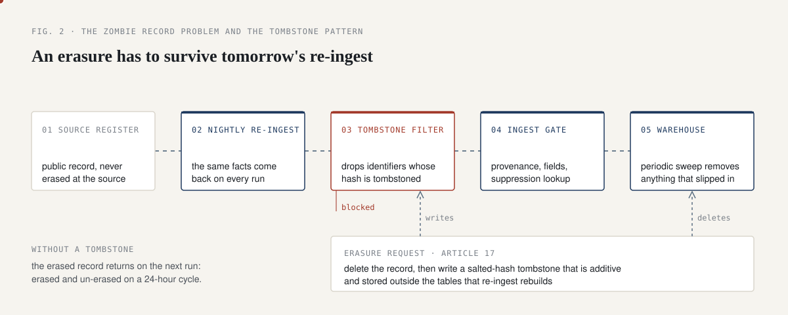

<p align="center">
  
</p>

<p align="center">
  <a href="https://github.com/darkanalytica1/gdpr-b2b-data-engineering/actions/workflows/tests.yml"></a>
  
  
  <a href="LICENSE"></a>
</p>

# GDPR B2B Data Engineering

## What this is

A reference implementation of GDPR compliance patterns for a B2B
prospecting or market-intelligence data pipeline. It has two halves that
are meant to be read together: the legal reasoning (legal basis, a full
Legitimate Interest Assessment, electronic-marketing rules, data subject
rights, retention) and the engineering patterns that enforce that reasoning
in code (a provenance envelope, an ingest gate, a role-versus-nominal email
classifier, a hashed suppression store, an erasure tombstone and a
field-class retention engine). The library uses only the Python standard
library, runs fully offline, and ships with synthetic data only.

## Why it matters

"We rely on legitimate interest" is a sentence teams say often and document
rarely. In practice, the compliance failures of a prospecting pipeline are
seldom legal misreadings; they are architectural gaps. There is no LIA on
file. A suppression list gets silently overwritten by the next import. An
erasure is undone by tomorrow's re-ingest from the same public register. A
contact is emailed because the list was frozen an hour before the person
objected.

Any team that builds lists from registers, tender portals or company
websites for outreach, due diligence or market intelligence faces the same
questions from a regulator or a data subject: where did this come from,
since when, under which basis, and why is it still here. This repository
writes the reasoning down and puts the conclusions into code that keeps
holding under operational pressure.

## How the pipeline enforces it

<p align="center">
  
</p>

Compliance is not a document beside the pipeline. Each stage is a check a
record has to pass, and the suppression store is consulted twice: at ingest
and again immediately before contact.

<p align="center">
  
</p>

The nightly re-ingest runs the same gauntlet, which is why an erasure or a
suppression survives it instead of being quietly undone.

<p align="center">
  
</p>

## Quick start

Requires Python 3.11 or later. The library has no runtime dependencies;
`pytest` is only needed for the tests.

```bash
git clone https://github.com/darkanalytica1/gdpr-b2b-data-engineering
cd gdpr-b2b-data-engineering
python3 -m venv .venv && source .venv/bin/activate
pip install -r requirements.txt

# End-to-end story on synthetic data:
# ingest -> reject -> classify -> suppress -> erase -> re-ingest -> retention
python -m gdpr_pipeline.demo

# Test suite (62 tests)
python -m pytest -q
```

An abridged run of the demo:

```
STEP 2: ingest gate evaluates the batch
  accepted: 2
  rejected: 3
    FAIL 'Shadowfax Logistics SRL': MISSING_PROVENANCE
    FAIL 'Ferrous Metalworks SRL': MALFORMED_SOURCE_URL
    FAIL 'Bare Facts SRL': NO_CONTACT_FIELD

STEP 6: nightly harvester runs again (run #2), same source facts, unchanged
  tombstone pre-filter: kept 4, blocked 1
    BLOCKED BY TOMBSTONE  'Northgate Traders SRL' <jane.doe@northgate-traders.example>
  ingest gate on run #2: accepted 0, rejected 4
    FAIL 'Acme Distribution SRL': SUPPRESSED
  suppression held across restart: True
  tombstone held across restart:    True

STEP 7: retention engine over the surviving warehouse
  company_name    class=identity   age_days=  10.0 ttl_days=730 -> keep
  email           class=contact    age_days=  45.0 ttl_days=30 -> expire
```

Step 7 of the demo deliberately overrides the contact TTL to 30 days so an
expiry is visible; the library default is 365 days. Everything runs
offline: nothing in this repository makes a network call, scrapes a website
or touches real data.

```python
from datetime import datetime, timezone
from gdpr_pipeline.provenance import Provenance, LegalBasis
from gdpr_pipeline.ingest_gate import IngestGate
from gdpr_pipeline.suppression import SuppressionStore

store = SuppressionStore(salt="deployment-secret")
gate = IngestGate(suppression_store=store)

record = {
    "company_name": "Example Trading SRL",
    "email": "office@company.example",
    "provenance": Provenance(
        source_url="https://registry.example/company/123",
        retrieved_at=datetime.now(timezone.utc),
        legal_basis=LegalBasis.LEGITIMATE_INTEREST,
    ),
}
result = gate.evaluate(record)
print(result.accepted, result.reason_codes)   # True []

store.add("office@company.example", reason="objection to marketing")
print(store.check_at_send("office@company.example"))   # False: do not contact
```

## Method

### Ten rules for a compliant B2B prospecting database

1. **Attach provenance to every third-party-derived fact, at ingest, not
   after the fact.** Source URL, retrieval timestamp and legal basis, or the
   record does not enter the warehouse. See
   [`gdpr_pipeline/provenance.py`](gdpr_pipeline/provenance.py) and
   [`gdpr_pipeline/ingest_gate.py`](gdpr_pipeline/ingest_gate.py).
2. **Write the Legitimate Interest Assessment down.** "We rely on
   legitimate interest" without a documented purpose test, necessity test
   and balancing test is an assumption, not an assessment. See
   [`docs/LIA_TEMPLATE.md`](docs/LIA_TEMPLATE.md) and
   [`docs/LIA_WORKED_EXAMPLE.md`](docs/LIA_WORKED_EXAMPLE.md).
3. **Treat role addresses and nominal addresses differently, on purpose.**
   `office@company.example` and `jane.doe@company.example` carry different
   risk and deserve different handling. See
   [`gdpr_pipeline/email_class.py`](gdpr_pipeline/email_class.py).
4. **Holding a contact and marketing to it are two different legal
   questions.** GDPR legitimate interest can justify holding a record while
   national ePrivacy-derived marketing law still governs, and can still
   block, an unsolicited email or call to it. See
   [`docs/EPRIVACY_ROMANIA.md`](docs/EPRIVACY_ROMANIA.md).
5. **Suppression is checked at send time, not at list-build time.** A list
   frozen an hour before a suppression request is not an excuse. See
   [`gdpr_pipeline/suppression.py`](gdpr_pipeline/suppression.py).
6. **Suppression and erasure records are hashed, additive, and independent
   of the warehouse tables that get rebuilt.** A fresh import must never be
   able to silently undo either. Same modules as above, plus
   [`gdpr_pipeline/tombstone.py`](gdpr_pipeline/tombstone.py).
7. **Erasure has to survive re-ingest, or it is not erasure.** A nightly
   job that re-pulls from the same public source will resurrect a deleted
   record unless a tombstone blocks it. See
   [`docs/DATA_SUBJECT_RIGHTS.md`](docs/DATA_SUBJECT_RIGHTS.md).
8. **Retention is per field class, not per record.** Identity, contact,
   behavioural and derived data decay at different rates and serve
   different purposes; one blanket retention period is almost always wrong
   for at least one of them. See
   [`gdpr_pipeline/retention.py`](gdpr_pipeline/retention.py) and
   [`docs/RETENTION.md`](docs/RETENTION.md).
9. **"We might need it later" is not a purpose.** If you cannot state, right
   now, in one sentence, what current purpose a field serves, it should not
   still be in the warehouse. See [`docs/RETENTION.md`](docs/RETENTION.md).
10. **When you collect data about someone from a third party, Article 14
    obliges you to tell them, including where the data came from.** Most
    prospecting data is collected this way, which makes this the default
    case, not the exception. See
    [`docs/ARTICLE_14_NOTICE_TEMPLATE.md`](docs/ARTICLE_14_NOTICE_TEMPLATE.md).

### Documentation (`docs/`)

| Document | What it covers |
|---|---|
| [`LEGAL_BASIS.md`](docs/LEGAL_BASIS.md) | When B2B prospecting data is lawful: the six Article 6 bases, why legitimate interest is the realistic one, and why holding data and marketing to it are separate questions. |
| [`LIA_TEMPLATE.md`](docs/LIA_TEMPLATE.md) | A blank, reusable Legitimate Interest Assessment: purpose test, necessity test, balancing test. |
| [`LIA_WORKED_EXAMPLE.md`](docs/LIA_WORKED_EXAMPLE.md) | The same template, filled in for a fictional company, so you can see what a real answer looks like. |
| [`EPRIVACY_ROMANIA.md`](docs/EPRIVACY_ROMANIA.md) | ePrivacy-derived electronic marketing rules, worked through Romania (Legea 506/2004, Legea 365/2002) as a concrete, hedged example. |
| [`DATA_SUBJECT_RIGHTS.md`](docs/DATA_SUBJECT_RIGHTS.md) | Access, erasure and objection inside a pipeline that re-ingests from source, including the zombie-record problem and the tombstone pattern that solves it. |
| [`RETENTION.md`](docs/RETENTION.md) | Field-class TTLs, what to drop and why, and why "we might need it later" fails as a purpose. |
| [`ARTICLE_14_NOTICE_TEMPLATE.md`](docs/ARTICLE_14_NOTICE_TEMPLATE.md) | A structural template for the notice required when data about someone is collected from a third party rather than from them. |

### Code (`gdpr_pipeline/`)

| Module | What it enforces |
|---|---|
| [`provenance.py`](gdpr_pipeline/provenance.py) | The `Provenance` dataclass (`source_url`, `retrieved_at`, `legal_basis`) and its validation rules, returned as structured errors rather than exceptions. |
| [`ingest_gate.py`](gdpr_pipeline/ingest_gate.py) | Rejects any record lacking valid provenance, required fields, a contact field, or matching a suppression entry, with listable reason codes. An unusual legal basis is flagged for review, not auto-rejected. |
| [`email_class.py`](gdpr_pipeline/email_class.py) | Classifies an address as role, nominal, junk or unknown; biased towards caution when unsure. |
| [`suppression.py`](gdpr_pipeline/suppression.py) | A salted-hash suppression store, checked at send time, that a fresh import cannot silently overwrite. |
| [`tombstone.py`](gdpr_pipeline/tombstone.py) | Erasure markers that block a record from re-entering on the next re-ingest, plus a sweep for records that slipped in by another path. |
| [`retention.py`](gdpr_pipeline/retention.py) | A field-class TTL engine: different expiry rules for identity, contact, behavioural and derived data. |
| [`demo.py`](gdpr_pipeline/demo.py) | An end-to-end, runnable story exercising every module above against a synthetic dataset. |

## Limitations and assumptions

**Disclaimer.** This is educational reference material, not legal advice.
Data protection law varies by jurisdiction, changes over time, and depends
on facts specific to your processing. Nothing here should be relied on
without review by a qualified Data Protection Officer or lawyer, and every
document in `docs/` repeats this disclaimer for a reason: read the code and
the templates as a well-reasoned starting point, not a certified answer.

All data in this repository, every company name, person name, email address
and phone number, is synthetic or obviously fictional. No real company or
individual's data is used anywhere in this codebase.

What the repository deliberately does not do:

- It does not scrape, describe how to scrape, or name any commercial data
  source. Examples refer only to official or public registers in the
  abstract (a "national companies registry", a "public tenders portal") and
  to first-party sources (a company's own published website).
- It does not ship a production-grade suppression or tombstone store: no
  database, no concurrency handling, no key or salt rotation tooling. The
  patterns are directly portable; the JSON-on-disk backend is a
  demonstration choice so everything runs offline on the standard library.
- The email classifier is a heuristic over English and Romanian mailbox
  conventions, not an oracle. When unsure it returns `nominal` or `unknown`
  rather than `role`.
- The default TTLs are an editable starting point, not a legal requirement;
  you still need to justify the numbers you choose for your own purposes.
- It does not cover every EU member state's ePrivacy transposition. Romania
  is one worked example, used to show the kind of local-law check every
  jurisdiction needs, not to claim the answer generalises.

## Sources

Primary legal texts referred to throughout `docs/`:

- Regulation (EU) 2016/679, General Data Protection Regulation: Articles
  5(1)(c)-(e), 6(1)(f), 13, 14, 15, 17, 21 and 30, and Recital 47
  ([EUR-Lex](https://eur-lex.europa.eu/eli/reg/2016/679/oj)).
- Directive 2002/58/EC, the ePrivacy Directive, Article 13 on unsolicited
  communications ([EUR-Lex](https://eur-lex.europa.eu/eli/dir/2002/58/oj)).
- Romania: Legea 506/2004 on personal data processing and privacy in
  electronic communications, and Legea 365/2002 on electronic commerce.
- European Data Protection Board guidance on legitimate interest and on
  transparency ([edpb.europa.eu](https://www.edpb.europa.eu/our-work-tools/general-guidance/guidelines-recommendations-best-practices_en)).

## License

MIT. See [`LICENSE`](LICENSE).
